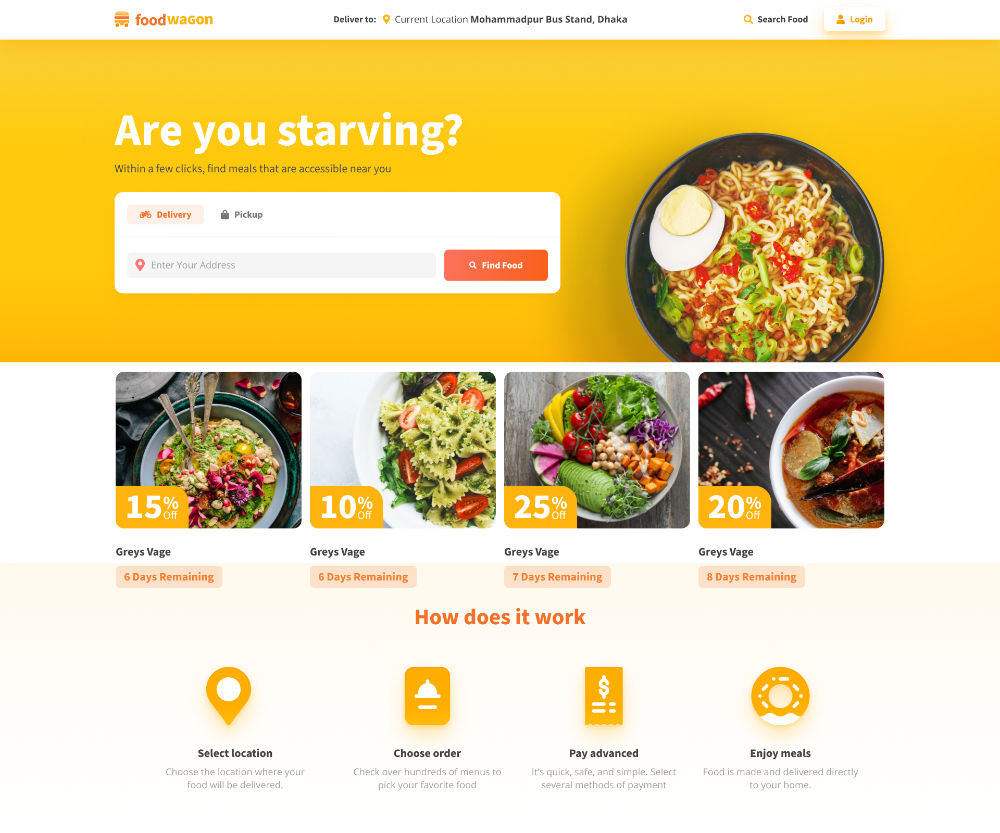
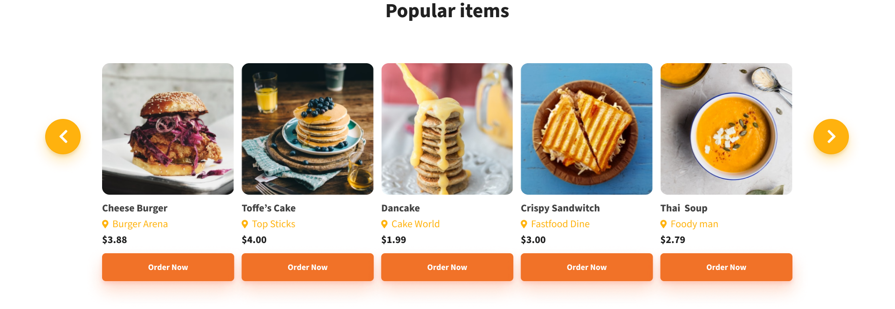
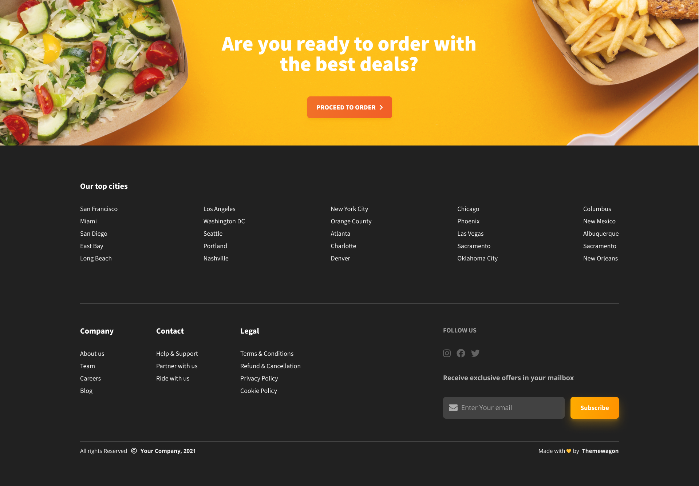

# Foodwagon

## Overview

**Foodwagon** is a modern and responsive food delivery landing page designed to showcase food delivery services. This project utilizes HTML, CSS, JavaScript, and Bootstrap to create a visually appealing and user-friendly interface.


## Features

- **Responsive Design**: Ensures compatibility across various devices and screen sizes.
- **Modern UI/UX**: Clean and intuitive design for an enhanced user experience.
- **Interactive Elements**: Engaging features like carousels, modals, and animations.
- **Easy Navigation**: Simple and efficient navigation structure.

## Technologies Used

- **HTML**: Markup language used for structuring the web page.
- **CSS**: Stylesheet language used for describing the presentation of the web page.
- **JavaScript**: Programming language used to create interactive effects and functionalities.
- **Bootstrap**: Framework used to develop responsive and mobile-first web pages.

## Installation

To get a local copy up and running, follow these simple steps:

1. **Clone the repository**:
    ```bash
    git clone https://github.com/ziaadwael/foodwagon.git
    ```
2. **Navigate to the project directory**:
    ```bash
    cd foodwagon
    ```
3. **Open `index.html` in your preferred browser**.

## Usage

- **Homepage**: Features a dynamic banner, service sections, and customer testimonials.
- **Menu Section**: Displays the available food items with images and descriptions.
- **CTA Section**: Provides a form for customers to get in touch.

## Screenshots





## Contributing

Contributions are what make the open-source community such an amazing place to be learn, inspire, and create. Any contributions you make are **greatly appreciated**.

1. Fork the Project.
2. Create your Feature Branch (`git checkout -b feature/AmazingFeature`).
3. Commit your Changes (`git commit -m 'Add some AmazingFeature'`).
4. Push to the Branch (`git push origin feature/AmazingFeature`).
5. Open a Pull Request.

## Contact

- **Facebook**: [Ziad Waael](https://www.facebook.com/ziaadwaael)
- **LinkedIn**: [Ziad Wael](https://www.linkedin.com/in/ziaadwael/)
- **Email**: ziadwaelelfeky@gmail.com

Project Link: [https://github.com/ziaadwaael/foodwagon](https://github.com/ziaadwaael/foodwagon)

